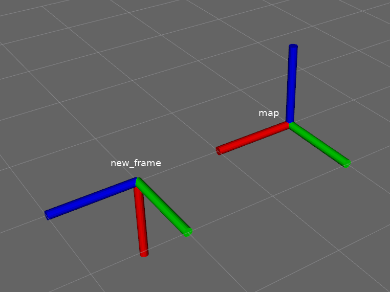

# Axes 

When you add the `Axes` plugin in RViz, it will default to attach itself to the `<Fixed Frame>`, i.e. the global frame. But what if we want to visualize a frame somewhere else? 

In order to do that we need to create a new frame, which can be achieved in multiple way. By [default](https://github.com/ros2/rviz#pluggable-transformation-library), RViz uses the [tf2](http://wiki.ros.org/tf2?distro=noetic) transformation library. There isn't any ROS2 specific documentation for tf2, but a lot of tutorials written for ROS1 can be found [here](http://wiki.ros.org/tf2/Tutorials).

The simplest way to add a new frame is to simply use the command line tool provided with the sub-package `tf2_ros`, namely: `static_transform_publisher`.

```
A command line utility for manually sending a transform.
Usage: static_transform_publisher x y z qx qy qz qw frame_id child_frame_id 
OR 
Usage: static_transform_publisher x y z yaw pitch roll frame_id child_frame_id 
```

My intuition for quaternions isn't that sharp, so let's demonstrate using Euler angles: 
```
ros2 run tf2_ros static_transform_publisher 2 0 0 0 1.5705 0 map new_frame
``` 
This will create a new frame, called `new_frame`, 2 units away from the parent frame `map`, while also being rotated ~$π\,$rad (1.5705) around the $x$-axis. 
where: 
* yaw - Rotation about the the $z$-axis (blue)
* pitch - Rotation about the $y$-axis (green)
* roll - Rotation about the $x$-axis (red)

In RViz, you need to change the `Reference Frame` parameter of the `Axes` plugin to be `new_frame`. 

If you also add a second `Axes` plugin that is referenced to the `<Fixed Frame>`, you should see something like this:



## Using C++ 
The above example is probably of little use since we typically want to visualize things from our ROS nodes. So let's do the same thing as above, but with C++! 

In order to do this we need to publish a `tf2_msgs::msg::TFMessage` on the topic `/tf_static`. From the [documentation](http://docs.ros.org/diamondback/api/tf2_msgs/html/msg/TFMessage.html), we can see that this is a vector of `geometry_msgs::msg::TransformStamped` messages. Thankfully we can forgo the "trouble" of having to create a vector and simply use the  `StaticTransformBroadcaster` class that `tf2_ros` provides.

All we have to do is:

1. Create a `geometry_msgs::msg::TransformStamped` message.
2. Create an instance of a `StaticTransformBroadcaster` 
3. Send the message using the `sendTransform` method. 

You can find the code [here](../src/axes_demo.cpp).

## Using Python 
[TODO]

## Troubleshooting

If you get strange garbled errors like below, then you have forgotten to add a dependency under `ament_target_dependencies` in the `CMakeLists.txt`. In the example below, it's because I removed `tf2_ros`.
```
--- stderr: rviz_demo                             
CMakeFiles/axes_demo.dir/src/axes_demo.cpp.o: In function `Axes::Axes(std::__cxx11::basic_string<char, std::char_traits<char>, std::allocator<char> >, std::__cxx11::basic_string<char, std::char_traits<char>, std::allocator<char> >)':
axes_demo.cpp:(.text._ZN4AxesC2ENSt7__cxx1112basic_stringIcSt11char_traitsIcESaIcEEES5_[_ZN4AxesC5ENSt7__cxx1112basic_stringIcSt11char_traitsIcESaIcEEES5_]+0x358): undefined reference to `tf2_ros::StaticTransformBroadcaster::sendTransform(geometry_msgs::msg::TransformStamped_<std::allocator<void> > const&)'
CMakeFiles/axes_demo.dir/src/axes_demo.cpp.o: In function `rclcpp::Publisher<tf2_msgs::msg::TFMessage_<std::allocator<void> >, std::allocator<void> >::Publisher(rclcpp::node_interfaces::NodeBaseInterface*, std::__cxx11::basic_string<char, std::char_traits<char>, std::allocator<char> > const&, rclcpp::QoS const&, rclcpp::PublisherOptionsWithAllocator<std::allocator<void> > const&)':
axes_demo.cpp:(.text._ZN6rclcpp9PublisherIN8tf2_msgs3msg10TFMessage_ISaIvEEES4_EC2EPNS_15node_interfaces17NodeBaseInterfaceERKNSt7__cxx1112basic_stringIcSt11char_traitsIcESaIcEEERKNS_3QoSERKNS_29PublisherOptionsWithAllocatorIS4_EE[_ZN6rclcpp9PublisherIN8tf2_msgs3msg10TFMessage_ISaIvEEES4_EC5EPNS_15node_interfaces17NodeBaseInterfaceERKNSt7__cxx1112basic_stringIcSt11char_traitsIcESaIcEEERKNS_3QoSERKNS_29PublisherOptionsWithAllocatorIS4_EE]+0x6a): undefined reference to `rosidl_message_type_support_t const* rosidl_typesupport_cpp::get_message_type_support_handle<tf2_msgs::msg::TFMessage_<std::allocator<void> > >()'
``` 

## Questions
One thing I do not understand is why `tf2_ros` needs to be added as a dependency, but not `tf2`? I am including `<tf2/LinearMath/Quaternion.h>`. 

## Acknowledgment 

My code is heavily inspired by the code for the `static_transform_broadcaster` tool provided by the `tf2_ros` package. The code can be found [here](https://github.com/ros2/geometry2/tree/ros2/tf2_ros/src).
