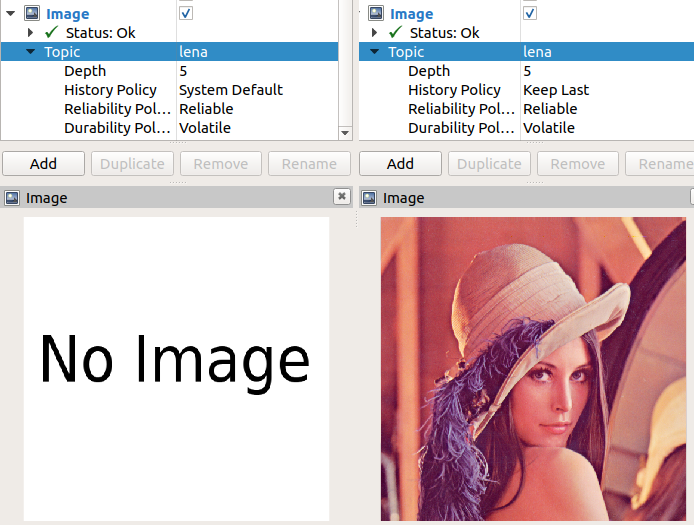

# Image

In this demo, we will make RViz visualize an image. This means we have to publish a `sensor_msgs::msg::Image` message to a topic that we set the plugin to subscribe to. 

We can find ROS1 the documentation for the message type [here](http://docs.ros.org/api/sensor_msgs/html/msg/Image.html), or the ROS2 specification on [GitHub](https://github.com/ros2/common_interfaces/blob/master/sensor_msgs/msg/Image.msg). 

We could probably figure out how assemble this message our selves, but thankfully there's the `cv_bridge` library which does all the heavy lifting for us. Nevertheless, we still have to do some coding.

In this demo, I'm assuming that you're reading your images using OpenCV. If you aren't you need to figure out how to convert it from your data type, into a `cv::Mat` format. After that you're in the clear! 


## C++ 
The gist of this demo is:

1. Load the image using OpenCV
2. Create a `sensor_msgs::msg::Image` message and populate it using the `cv_bridge` library. 
3. Publish the message to a topic, e.g. `lena`. 

The code can be found [here](../src/image_demo.cpp).

### `CMakeLists.txt`
In order to compile, you need to make sure you have the following in your `CMakeLists.txt`.
```
find_package(rclcpp REQUIRED)
find_package(cv_bridge REQUIRED)
find_package(sensor_msgs REQUIRED)

add_executable(image_demo
  src/image_demo.cpp
)
# Specify dependencies for this specific target
ament_target_dependencies(image_demo
  rclcpp
  cv_bridge
  sensor_msgs
)

# Install in /base_ws/install/ so that `ros2 run` can find it. 
install(TARGETS
  image_demo
  DESTINATION lib/${PROJECT_NAME}
)
```  

## Compile
```
colcon build --packages-select rviz_demo
```

## Running

(**Note:** Remember to source the local installation: `source install/local_setup.bash`)

Run RViz:
```
ros2 run rviz2 rviz2 
```
Then add the image plugin, and specify the topic name as `lena`. And finally you can run the demo package:
```
ros2 run rviz_demo image_demo
```

In RViz, you should now see a progression like this:


(**Btw:** If you are not familiar with the picture of Lena Forsén I recommend you to read the [Wikipedia article](https://en.wikipedia.org/wiki/Lenna) about it. It has a long standing history in the Computer Vision community. Similar to how the [Utah pot](https://en.wikipedia.org/wiki/Utah_teapot) and the [Stanford bunny](https://en.wikipedia.org/wiki/Stanford_bunny) is famous in the Computer Graphics community.


## Troubleshooting

If you get strange garbled errors like below, then you have forgotten to add a dependency under `ament_target_dependencies` in the `CMakeLists.txt`. In the example below, it's because I forgot to add `sensor_msgs`.
```
CMakeFiles/image_demo.dir/src/image_demo.cpp.o: In function `rclcpp::Publisher<sensor_msgs::msg::Image_<std::allocator<void> >, std::allocator<void> >::Publisher(rclcpp::node_interfaces::NodeBaseInterface*, std::__cxx11::basic_string<char, std::char_traits<char>, std::allocator<char> > const&, rclcpp::QoS const&, rclcpp::PublisherOptionsWithAllocator<std::allocator<void> > const&)':
image_demo.cpp:(.text._ZN6rclcpp9PublisherIN11sensor_msgs3msg6Image_ISaIvEEES4_EC2EPNS_15node_interfaces17NodeBaseInterfaceERKNSt7__cxx1112basic_stringIcSt11char_traitsIcESaIcEEERKNS_3QoSERKNS_29PublisherOptionsWithAllocatorIS4_EE[_ZN6rclcpp9PublisherIN11sensor_msgs3msg6Image_ISaIvEEES4_EC5EPNS_15node_interfaces17NodeBaseInterfaceERKNSt7__cxx1112basic_stringIcSt11char_traitsIcESaIcEEERKNS_3QoSERKNS_29PublisherOptionsWithAllocatorIS4_EE]+0x6a): undefined reference to `rosidl_message_type_support_t const* rosidl_typesupport_cpp::get_message_type_support_handle<sensor_msgs::msg::Image_<std::allocator<void> > >()'
``` 

## Questions
When I compile, I get the following warning:
```
/usr/bin/ld: warning: libopencv_imgcodecs.so.3.2, needed by /opt/ros/eloquent/lib/libcv_bridge.so, may conflict with libopencv_imgcodecs.so.4.4
/usr/bin/ld: warning: libopencv_core.so.3.2, needed by /opt/ros/eloquent/lib/libcv_bridge.so, may conflict with libopencv_core.so.4.4
```
I am not sure how to mitigate these.

